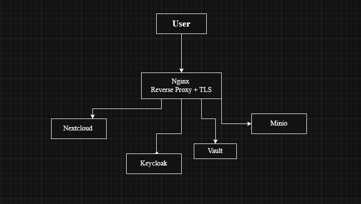

# 🏗️ System Architecture

## Overview

The lab is a self-hosted cloud platform running on a single Ubuntu Server VM, with every service containerized via Docker Compose. Nginx sits at the network edge as a TLS-terminating reverse proxy, Keycloak provides centralized identity for the whole stack, and Nextcloud is the user-facing application backed by PostgreSQL, MinIO, and HashiCorp Vault.

## Components

| Component | Role | Notes |
|---|---|---|
| **Nginx** | Reverse proxy / TLS termination | Single entry point for all inbound traffic; enforces HTTPS |
| **Keycloak** | Identity Provider (IdP) | `cloud-lab` realm; issues OIDC tokens; enforces MFA for Admin |
| **Nextcloud** | Cloud storage / application layer | Federates auth to Keycloak via OIDC SSO; enforces RBAC via group mapping |
| **PostgreSQL** | Database | Backing store for Nextcloud application data |
| **MinIO** | Object storage | S3-compatible storage backend |
| **HashiCorp Vault** | Secrets & key management | Centralized store for credentials, tokens, and encryption keys; versioned |
| **Fail2ban** | Intrusion prevention | Watches Nginx/Nextcloud auth logs, auto-bans brute-force IPs |
| **GoAccess** | Log analysis | Real-time traffic/log visualization for investigation |
| **Trivy** | Vulnerability scanning | Scans all container images for known CVEs |

## Request & Auth Flow

1. A user's browser hits **Nginx** over HTTPS (TLS termination happens here — see [Phase 3](../docs/reports/phase3-encryption.md)).
2. Nginx forwards the request to **Nextcloud**.
3. If the user isn't authenticated, Nextcloud redirects to **Keycloak** for login via the OpenID Connect Authorization Code flow.
4. Keycloak authenticates the user (and enforces TOTP MFA if they're in the Admin role), then issues an OIDC token back to Nextcloud.
5. Nextcloud maps the user's Keycloak role (Admin / Editor / Viewer) to the matching Nextcloud group, which determines what they can see and do.
6. File operations are persisted through **PostgreSQL** (metadata) and **MinIO** (object data); files at rest are protected by Nextcloud's Server-Side Encryption.
7. Any secrets or keys needed by the stack (DB credentials, encryption keys, API tokens) are pulled from **Vault** rather than stored in plaintext config.
8. All authentication attempts are logged; **Fail2ban** watches those logs continuously and auto-bans an IP after repeated failed logins (see [security-monitoring/fail2ban](../security-monitoring/fail2ban)).

## Network & Trust Boundaries

- **Edge:** Nginx is the only service exposed to the host network; all other containers communicate over the internal Docker network.
- **Identity boundary:** Keycloak is the sole source of truth for authentication — no service performs its own password checks.
- **Data boundary:** Vault is the sole source of truth for secrets — no credentials are hardcoded in compose files or app configs.

## Related Documentation

- [Phase 1 — Infrastructure Setup](../docs/reports/phase1-infrastructure-setup.md)
- [Phase 2 — IAM Policy](../docs/reports/phase2-iam-policy.md)
- [Phase 3 — Encryption](../docs/reports/phase3-encryption.md)
- [Security Monitoring](../security-monitoring)
