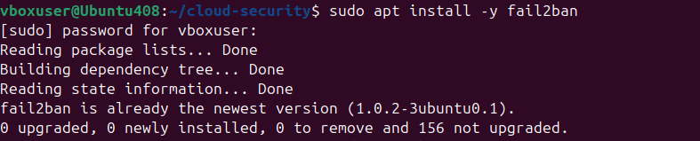

# Fail2ban — Brute-Force Detection & Prevention

Fail2ban continuously monitors Nginx and Nextcloud authentication logs. When it sees repeated failed login attempts from the same IP within a short window, it automatically bans that IP for the configured duration — no manual intervention required.

## Monitored Log Sources

- `/var/log/nginx/access.log`
- `/var/log/nginx/error.log`
- `/var/log/nextcloud/nextcloud.log`

## Active Jails

- `nginx-http-auth`
- `nextcloud`

## Operational Commands

```bash
# Check active bans
sudo fail2ban-client status nextcloud

# Manually ban an IP
sudo fail2ban-client set nextcloud banip <IP>

# Manually remove a ban
sudo fail2ban-client set nextcloud unbanip <IP>
```

## Screenshots

### 1. Install & configure Fail2ban
| | |
|---|---|
|  |  |
|  |  |

### 2. Simulated brute-force attack — detected & auto-banned
| | |
|---|---|
|  |  |

A repeated-failed-login pattern was generated against Nextcloud to validate the jail; Fail2ban picked it up within the configured retry threshold and banned the source IP automatically.

---
📄 Full write-up: [Phase 4 — Incident Response Runbook](../../docs/reports/phase4-incident-response-runbook.md)
